<!--
  Public profile README — cybersec edition, August 2026.
  No email, phone, location, employer, education or private identifiers.
-->

<div align="center">

<a href="https://sergigtar.dev/">
  
</a>

<br>

<a href="https://sergigtar.dev/">
  
</a>
<a href="https://www.linkedin.com/in/sergigtar">
  
</a>


</div>

<table>
  <tr>
    <td width="68%" valign="top">
      <h2><code>sergigtar@console:~$ whoami</code></h2>
      <p>
        Software engineer moving deeper into cybersecurity, with a
        <strong>security-first</strong> mindset and a product-aware approach.
      </p>
      <p>
        I care about systems that remain understandable under pressure: clear
        trust boundaries, secure defaults, useful automation and evidence that
        another person can reproduce.
      </p>
      <p><code>BUILD → HARDEN → VERIFY → IMPROVE</code></p>
    </td>
    <td width="32%" align="center" valign="middle">
      <a href="https://sergigtar.dev/">
        
      </a>
      <br>
      <sub>visual identity · sergigtar.dev</sub>
    </td>
  </tr>
</table>

### `> current_focus`

```text
┌─ SECURITY TRACK / 2026
│
├─ application security
├─ secure software architecture
├─ privacy-aware engineering
├─ threat-aware development
├─ defensive automation
└─ reproducible technical research
```

### `> engineering_core`

<div align="center">


</div>

### `> operating_principles`

| Signal | Practice |
|:--|:--|
| `ASSUME LESS` | Make trust boundaries explicit and keep privileges narrow. |
| `EVIDENCE > VIBES` | Reproduce, measure and document before drawing conclusions. |
| `SECURE BY DEFAULT` | Treat security as a design constraint, not a final checklist. |
| `LEAVE A TRAIL` | Make fixes and workarounds safe for the next person to follow. |

<details>
<summary><strong><code>open_source_protocol.md</code></strong></summary>

When I report an issue, I aim to leave maintainers with:

1. A minimal, deterministic reproduction.
2. Exact observed and expected behaviour.
3. Sanitised evidence with no credentials or private infrastructure.
4. A bounded workaround when one is available.
5. A clear distinction between verified facts and hypotheses.

</details>

---

<div align="center">

<code>status: learning continuously · building deliberately · disclosing responsibly</code>

<br><br>

<a href="https://sergigtar.dev/"><strong>sergigtar.dev</strong></a>
&nbsp;·&nbsp;
<a href="https://www.linkedin.com/in/sergigtar"><strong>LinkedIn</strong></a>

<br><br>

<sub>PUBLIC PROFILE // LAST REFRESH: AUGUST 2026 // NO TRACKERS // NO VIEW COUNTERS</sub>

</div>
