<!--
  SERGIGTAR OS // public profile terminal // August 2026
  Responsive static local assets only. No email, phone, location, trackers or view counters.
-->

  <a href="https://sergigtar.dev/" aria-label="Open SergiGTAr's portfolio">
    <picture>
      <source media="(prefers-color-scheme: dark)" srcset="./assets/pipboy-terminal-dark.svg">
      <source media="(prefers-color-scheme: light)" srcset="./assets/pipboy-terminal-light.svg">
      
    </picture>
  </a>

  <a href="https://sergigtar.dev/" aria-label="Enter the SergiGTAr portfolio">
    <picture>
      <source media="(prefers-color-scheme: dark)" srcset="./assets/nav-portfolio-dark.svg">
      <source media="(prefers-color-scheme: light)" srcset="./assets/nav-portfolio-light.svg">
      
    </picture>
  </a>
  <a href="https://www.linkedin.com/in/sergigtar" aria-label="Open SergiGTAr on LinkedIn">
    <picture>
      <source media="(prefers-color-scheme: dark)" srcset="./assets/nav-linkedin-dark.svg">
      <source media="(prefers-color-scheme: light)" srcset="./assets/nav-linkedin-light.svg">
      
    </picture>
  </a>
  <a href="https://orcid.org/0009-0001-2398-9224" aria-label="Open SergiGTAr's ORCID record">
    <picture>
      <source media="(prefers-color-scheme: dark)" srcset="./assets/nav-orcid-dark.svg">
      <source media="(prefers-color-scheme: light)" srcset="./assets/nav-orcid-light.svg">
      
    </picture>
  </a>

<picture>
  <source media="(prefers-color-scheme: dark)" srcset="./assets/operator-brief-dark.svg">
  <source media="(prefers-color-scheme: light)" srcset="./assets/operator-brief-light.svg">
  
</picture>

<picture>
  <source media="(prefers-color-scheme: dark)" srcset="./assets/systems-map-dark.svg">
  <source media="(prefers-color-scheme: light)" srcset="./assets/systems-map-light.svg">
  
</picture>

<strong><code>OPEN // FIELD_MANUAL: RESPONSIBLE_OPEN_SOURCE.MD</code></strong>

### `> report_protocol`

When I report an issue, I aim to leave maintainers with:

1. A minimal, deterministic reproduction.
2. Exact observed and expected behaviour.
3. Sanitised evidence with no credentials or private infrastructure.
4. A bounded workaround when one is available.
5. A clear distinction between verified facts and hypotheses.

### `> operating_principles`

| Signal | Practice |
|:--|:--|
| `ASSUME LESS` | Make trust boundaries explicit and keep privileges narrow. |
| `EVIDENCE > VIBES` | Reproduce, measure and document before drawing conclusions. |
| `SECURE BY DEFAULT` | Treat security as a design constraint, not a final checklist. |
| `LEAVE A TRAIL` | Make fixes and workarounds safe for the next person to follow. |

 

<picture>
  <source media="(prefers-color-scheme: dark)" srcset="./assets/footer-status-dark.svg">
  <source media="(prefers-color-scheme: light)" srcset="./assets/footer-status-light.svg">
  
</picture>

  <code>SERGIGTAR OS // PUBLIC NODE // LAST REFRESH: AUGUST 26, 2026</code>

